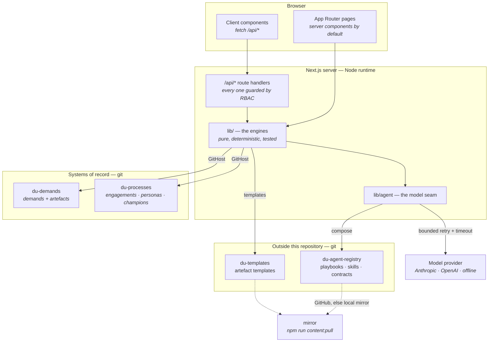
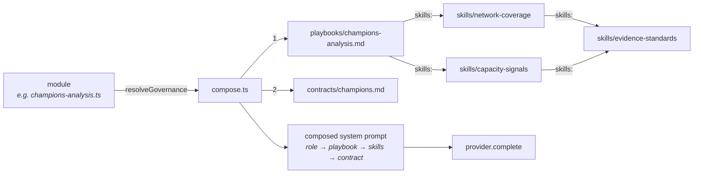
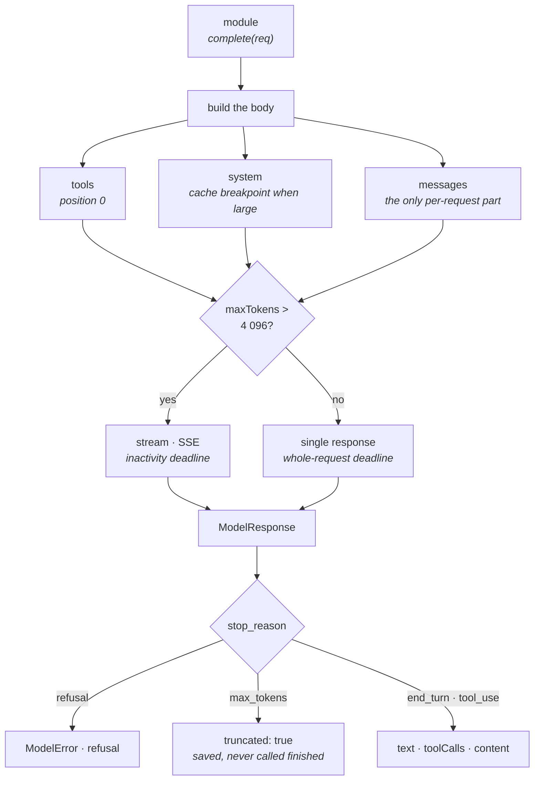
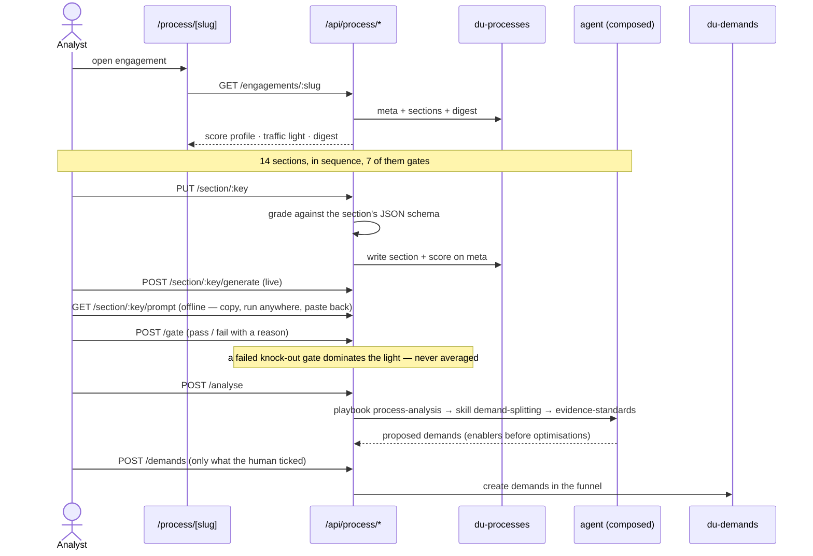
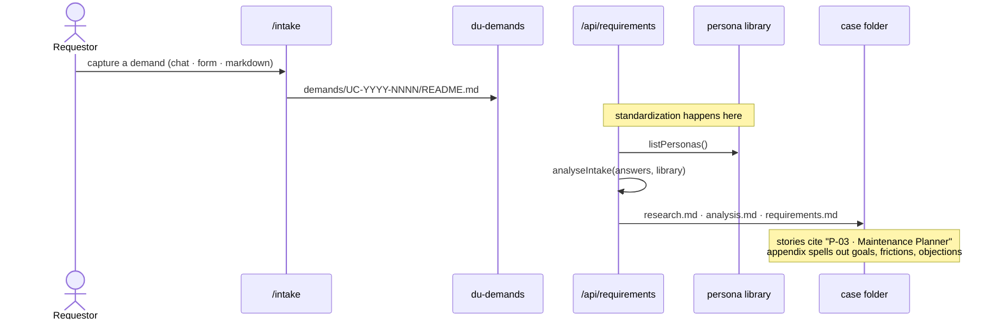
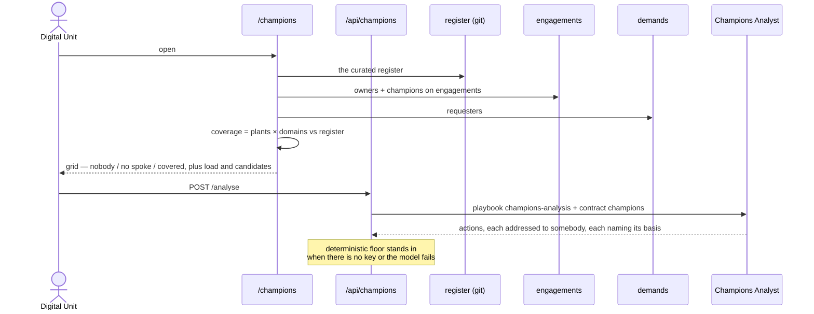

# The portal, end to end

The reference map. Three of the four files here are **generated from the source tree**
(`node scripts/gen-docs.mjs`) and a test regenerates and compares them, so they cannot
quietly go stale — a hand-maintained diagram is wrong within a fortnight and, being
wrong, is worse than none, because a reader trusts a diagram.

Two repositories carry what this one deliberately does not:
**`du-agent-registry`** (playbooks · skills · contracts) and **`du-templates`**
(artefact templates). Populate them locally with `npm run content:pull`; without
them the portal still runs, and says so — see §5.

| File | What it covers | Kept true by |
|---|---|---|
| **MAP.md** (this file) | how the pieces fit, and the journeys through them | reviewed by hand |
| [api-map.md](./api-map.md) | every HTTP endpoint and its verbs | generated |
| [pages.md](./pages.md) | every page and the endpoints it calls | generated |
| [governance.md](./governance.md) | every playbook, skill and contract, and what composes what | generated |

---

## 1. The shape of the system

Four decisions hold this together and explain most of the code:

1. **Git is the system of record.** Not a database. Every artefact is a file whose
   change is a reviewable diff, so "who changed this and why" needs no audit table.
   With no GitHub App configured the same code writes to a local directory, so the
   portal runs identically offline.
2. **The engines are deterministic and the model is optional.** Every AI feature has
   a rule-based floor that produces a usable answer with no key. A model refines;
   it is never the only path. The header says which you are getting.
3. **Governance and templates are not in this repository.** The playbooks, skills
   and contracts live in `du-agent-registry`; the artefact templates live in
   `du-templates`. The app repo carries machinery, not method — so the portal can
   be read, forked or handed over without handing over the thing that makes it
   work, and the people who own the method can change it without a deploy. No
   module hardcodes a prompt and none holds a bundled copy: resolution is GitHub →
   local mirror (`npm run content:pull`) → reported as missing.
4. **Both integration seams are bounded.** Git and model calls go through one retry
   envelope with per-attempt timeouts, retrying transient failures only.

---

## 2. How an agent gets its behaviour

Every AI feature resolves the same way. This is the seam that makes the platform
extensible: a new agent is a playbook file plus a name, not a TypeScript change.

- A **playbook** says what to do. A **skill** says how. A **contract** says what may
  never happen, and is placed last because the last thing in a system prompt is the
  thing a model weights hardest.
- **Skills compose skills.** `evidence-standards` is written once and reached by
  every method that needs it. Resolution is transitive, depth-first in declaration
  order, deduplicated at first mention, and deterministic.
- **A missing skill is stated in the prompt**, never skipped — an agent quietly
  running on half its governance still looks governed, which is the worst failure
  this system has. A cycle terminates and is reported.
- `docs/governance.md` draws the actual graph; `library-integrity.test.ts` fails the
  build if any reference in it is broken.

---

## 2b. How a call reaches the model

Everything asks `complete()` and gets back the same shape whichever provider
answered — which is what lets the whole product run with no key at all, and what
makes it **provider-agnostic**. A `PROVIDERS` catalogue (`lib/agent/provider.ts`)
is the single source of truth for what the portal can talk to: Anthropic natively
over the Messages API, OpenAI over Chat Completions, and — the same wire protocol
pointed at any base URL — **any OpenAI-compatible endpoint** (OpenRouter, Groq,
Together, Azure OpenAI, Ollama, vLLM, a local runtime). Adding one is a catalogue
entry, not code.

Which provider and model are active is resolved in three layers, most specific
first: an **admin's runtime choice** (persisted in KV, set from the options page
with no redeploy — `lib/model-settings.ts`), then the **environment**
(`MODEL_PROVIDER`, the per-provider key/base-URL/model vars), then automatic
selection by priority among whatever is configured, and finally offline. Keys and
base URLs stay in the environment and never pass through the browser; the options
picker moves only the *choice*, and offers only providers whose credentials are
already present.

Five decisions, each of which is load-bearing:

1. **`claude-opus-5` is the default** for the Anthropic provider, and the model
   name is what selects the server-tool versions — the older web-search tool is a
   400 on a current model and the current one is a 400 on an older one. Each
   catalogue provider carries its own default, so there is always a default model
   whatever the active provider.
2. **The system prompt is the cache breakpoint.** Render order is tools → system
   → messages, so a marker on the system block caches both. The composed
   governance prompts run to tens of thousands of characters and are
   byte-identical across engagements, so everything after the first call reads
   the prefix from cache. *Anything appended per-request to `system` destroys
   this* — a locale sentence in the wrong place cost every German run the cache
   the English runs had just paid to write. Per-request content belongs in the
   user turn.
3. **Large generations stream.** Not for the typing effect — a 9 000-token
   digest cannot be asked to finish inside one request timeout. Streaming turns
   "did it finish in time" into "is data still arriving", which is the question
   that has a correct answer.
4. **The assistant turn is replayed verbatim.** Thinking is on by default on
   Opus 5, and a turn rebuilt from its text and tool calls has silently lost the
   signed thinking block the next request must carry. Blocks the portal does not
   understand are carried through untouched.
5. **A stop reason is not an answer.** `max_tokens` marks the artefact truncated
   and the UI says so; `refusal` raises rather than saving the empty document it
   arrives with.

Failures are typed (`ModelError.kind`) so a caller can tell "your key is wrong"
— stop, tell somebody — from "the model is busy", where the right answer is the
deterministic floor and no drama.

On the way back, three rules hold for tool results:

- **A failed tool is marked failed** (`is_error`). Otherwise "Error: the register
  is unreachable" reads as a finding about the register.
- **A runaway result is cut, and says it was cut.** A tool that returns the world
  evicts the conversation it was meant to inform; a silent cut leaves the model
  reasoning confidently about half a table.
- **Running out of steps is an answer, not silence.** The loop that exhausts its
  iterations says so; returning "" would present "I ran out of steps" as "I have
  nothing to say".

Tools are offered in name order, which is also not cosmetic: tool definitions
render at position 0, so their order is the head of the cache prefix. In
registration order, adding an import somewhere would reshuffle the array and
invalidate the cache for every agent in the portal.

---

## 3. The journeys

### 3.1 Pre-funnel → demand (the Process Funnel)

A process is diagnosed *before* anything enters the demand funnel, and the diagnosis
is what the demands are cut from.

The split is governed, not hardcoded: `demand-splitting` is where "one demand per
intervention, smallest valuable cut first, enablers before optimisations" lives, and
editing that file changes the behaviour without a deploy.

### 3.2 Demand → requirements, in the persona vocabulary

With an empty library the stories fall back to plain role names — which at least
*look* like the guesses they are. The library is deliberately never pre-filled: a
generated record carries a role name and nothing anybody said, and the moment it has
an id a document cites it and a placeholder has become a definition.

### 3.3 The network: who carries the work

Everything except the register is derived from work already happening, because a
register nobody maintains is stale in a month.

---

## 4. What the two people-facing tools may never do

Both read records about named humans, so their contracts are load-bearing and are
enforced structurally as well as stated:

| | Persona Analyst | Champions Analyst |
|---|---|---|
| Subject | a requestor's own demands | the network's coverage |
| Never | ranks, scores or compares people | ranks people by load |
| Aggregates | cohorts of ≥ 2 requestors, so no aggregate resolves to one person | findings are about cells, not persons |
| Load/volume | not reported as a measure of a person | reported only to decide who to relieve |
| Output | descriptive facts | proposals a human decides on |

A gap is a finding about the organisation's coverage, which is the hub's
responsibility. It is never a finding about a person.

---

## 5. Degradation — what happens when something is missing

The portal is designed to be useful in every one of these states, and to say which
one it is in rather than pretending.

| Missing | What still works | What you see |
|---|---|---|
| The registry | the engines, the UI, every deterministic path | every agent reports missing governance; `/api/status` → `content.registry.ok: false` |
| The templates | everything except a pre-filled section | "Load template" does nothing and the prompt says the template is unavailable |
| Model key | everything — deterministic engines, prompt export for every agent | header reads **Offline**; "copy prompt, run it in your assistant, paste it back" |
| GitHub App | everything — local file store under the OS temp dir | `/api/status` reports `git.live: false` |
| A skill file | the agent runs | the prompt says which governance is missing; the UI marks the run partial |
| A playbook | the agent refuses that step | stated in the prompt, surfaced by `governedBy().healthy` |
| Both keys | the whole portal, rule-based | a demo that is honest about being one |

And when the model answers, but badly:

| What happened | What the portal does | What you see |
|---|---|---|
| The output ceiling was hit | saves the draft — 6 000 tokens of usable text is not rubbish | "saved, but cut off", not the completion tick |
| The model declined | raises before anything is written | the pass failed, with the reason |
| Rate-limited or overloaded | bounded retry, then the deterministic floor | fewer and duller actions, and the header says rule-based |
| The key is wrong | fails immediately — retrying a 401 makes one clear error into three slow ones | `/api/status?probe=1` → `health.ok: false` |
| A stream goes silent | the attempt is aborted on inactivity, not on elapsed time | a long generation is allowed to be long |
