<!-- GENERATED by scripts/gen-docs.mjs — do not edit by hand. Run `node scripts/gen-docs.mjs`. -->

# API map

Every HTTP endpoint the portal exposes: **58 routes**, grouped by area.
Generated from `app/api/**/route.ts`, so it cannot drift from the code.

```mermaid
graph LR
  subgraph agent["/api/agent"]
    _api_agent["/<br/><i>POST</i>"]
  end
  subgraph auth["/api/auth"]
    _api_auth_callback["/callback<br/><i>GET</i>"]
    _api_auth_login["/login<br/><i>GET</i>"]
    _api_auth_logout["/logout<br/><i>GET POST</i>"]
  end
  subgraph business_case["/api/business-case"]
    _api_business_case["/<br/><i>POST</i>"]
  end
  subgraph categories["/api/categories"]
    _api_categories["/<br/><i>GET POST</i>"]
  end
  subgraph champions["/api/champions"]
    _api_champions__id_["/[id]<br/><i>PUT DELETE</i>"]
    _api_champions_analyse["/analyse<br/><i>POST</i>"]
    _api_champions["/<br/><i>GET POST</i>"]
  end
  subgraph cron["/api/cron"]
    _api_cron_digest["/digest<br/><i></i>"]
    _api_cron_flush["/flush<br/><i></i>"]
  end
  subgraph demands["/api/demands"]
    _api_demands__id__advance["/[id]/advance<br/><i>POST</i>"]
    _api_demands__id__attachments["/[id]/attachments<br/><i>POST</i>"]
    _api_demands__id__edit["/[id]/edit<br/><i>POST</i>"]
    _api_demands__id__requirements_edits["/[id]/requirements-edits<br/><i>POST</i>"]
    _api_demands__id__state["/[id]/state<br/><i>POST</i>"]
    _api_demands__id__triage["/[id]/triage<br/><i>POST</i>"]
    _api_demands__id__verification["/[id]/verification<br/><i>POST</i>"]
  end
  subgraph intake["/api/intake"]
    _api_intake_enhance["/enhance<br/><i>POST</i>"]
    _api_intake["/<br/><i>POST</i>"]
    _api_intake_similar["/similar<br/><i>GET</i>"]
    _api_intake_turn["/turn<br/><i>POST</i>"]
  end
  subgraph model_settings["/api/model-settings"]
    _api_model_settings["/<br/><i>GET POST</i>"]
  end
  subgraph personas["/api/personas"]
    _api_personas_library__id_["/library/[id]<br/><i>GET PUT DELETE</i>"]
    _api_personas_library["/library<br/><i>GET POST</i>"]
  end
  subgraph poc["/api/poc"]
    _api_poc["/<br/><i>POST</i>"]
  end
  subgraph process["/api/process"]
    _api_process_config["/config<br/><i>GET</i>"]
    _api_process_engagements__slug__advisory__key__decide["/engagements/[slug]/advisory/[key]/decide<br/><i>POST</i>"]
    _api_process_engagements__slug__advisory__key__generate["/engagements/[slug]/advisory/[key]/generate<br/><i>POST</i>"]
    _api_process_engagements__slug__advisory__key__prompt["/engagements/[slug]/advisory/[key]/prompt<br/><i>GET</i>"]
    _api_process_engagements__slug__advisory__key_["/engagements/[slug]/advisory/[key]<br/><i>GET PUT</i>"]
    _api_process_engagements__slug__analyse["/engagements/[slug]/analyse<br/><i>POST</i>"]
    _api_process_engagements__slug__demands["/engagements/[slug]/demands<br/><i>POST</i>"]
    _api_process_engagements__slug__digest_prompt["/engagements/[slug]/digest/prompt<br/><i>GET</i>"]
    _api_process_engagements__slug__digest["/engagements/[slug]/digest<br/><i>GET POST PUT</i>"]
    _api_process_engagements__slug__dimension__dim__coach["/engagements/[slug]/dimension/[dim]/coach<br/><i>POST</i>"]
    _api_process_engagements__slug__dimension__dim__prompt["/engagements/[slug]/dimension/[dim]/prompt<br/><i>GET</i>"]
    _api_process_engagements__slug__dimension__dim_["/engagements/[slug]/dimension/[dim]<br/><i>GET PUT</i>"]
    _api_process_engagements__slug__gate["/engagements/[slug]/gate<br/><i>POST</i>"]
    _api_process_engagements__slug__meta["/engagements/[slug]/meta<br/><i>PATCH</i>"]
    _api_process_engagements__slug__rate["/engagements/[slug]/rate<br/><i>POST</i>"]
    _api_process_engagements__slug__report["/engagements/[slug]/report<br/><i>GET</i>"]
    _api_process_engagements__slug_["/engagements/[slug]<br/><i>GET DELETE</i>"]
    _api_process_engagements__slug__section__key__generate["/engagements/[slug]/section/[key]/generate<br/><i>POST</i>"]
    _api_process_engagements__slug__section__key__prompt["/engagements/[slug]/section/[key]/prompt<br/><i>GET</i>"]
    _api_process_engagements__slug__section__key_["/engagements/[slug]/section/[key]<br/><i>GET PUT</i>"]
    _api_process_engagements["/engagements<br/><i>GET POST</i>"]
    _api_process_self_assessment["/self-assessment<br/><i>GET POST</i>"]
  end
  subgraph registry["/api/registry"]
    _api_registry_import["/import<br/><i>POST</i>"]
    _api_registry_item["/item<br/><i>GET</i>"]
    _api_registry["/<br/><i>GET</i>"]
    _api_registry_save["/save<br/><i>POST</i>"]
    _api_registry_search["/search<br/><i>POST</i>"]
  end
  subgraph requirements["/api/requirements"]
    _api_requirements["/<br/><i>POST</i>"]
  end
  subgraph status["/api/status"]
    _api_status["/<br/><i>GET</i>"]
  end
  subgraph usage["/api/usage"]
    _api_usage["/<br/><i>GET POST</i>"]
    _api_usage_track["/track<br/><i>POST</i>"]
  end
  subgraph webhooks["/api/webhooks"]
    _api_webhooks_github["/github<br/><i>POST</i>"]
  end
```

| Route | Methods | Source |
|---|---|---|
| `/api/agent` | POST | `app/api/agent/route.ts` |
| `/api/auth/callback` | GET | `app/api/auth/callback/route.ts` |
| `/api/auth/login` | GET | `app/api/auth/login/route.ts` |
| `/api/auth/logout` | GET, POST | `app/api/auth/logout/route.ts` |
| `/api/business-case` | POST | `app/api/business-case/route.ts` |
| `/api/categories` | GET, POST | `app/api/categories/route.ts` |
| `/api/champions/[id]` | PUT, DELETE | `app/api/champions/[id]/route.ts` |
| `/api/champions/analyse` | POST | `app/api/champions/analyse/route.ts` |
| `/api/champions` | GET, POST | `app/api/champions/route.ts` |
| `/api/cron/digest` | — | `app/api/cron/digest/route.ts` |
| `/api/cron/flush` | — | `app/api/cron/flush/route.ts` |
| `/api/demands/[id]/advance` | POST | `app/api/demands/[id]/advance/route.ts` |
| `/api/demands/[id]/attachments` | POST | `app/api/demands/[id]/attachments/route.ts` |
| `/api/demands/[id]/edit` | POST | `app/api/demands/[id]/edit/route.ts` |
| `/api/demands/[id]/requirements-edits` | POST | `app/api/demands/[id]/requirements-edits/route.ts` |
| `/api/demands/[id]/state` | POST | `app/api/demands/[id]/state/route.ts` |
| `/api/demands/[id]/triage` | POST | `app/api/demands/[id]/triage/route.ts` |
| `/api/demands/[id]/verification` | POST | `app/api/demands/[id]/verification/route.ts` |
| `/api/intake/enhance` | POST | `app/api/intake/enhance/route.ts` |
| `/api/intake` | POST | `app/api/intake/route.ts` |
| `/api/intake/similar` | GET | `app/api/intake/similar/route.ts` |
| `/api/intake/turn` | POST | `app/api/intake/turn/route.ts` |
| `/api/model-settings` | GET, POST | `app/api/model-settings/route.ts` |
| `/api/personas/library/[id]` | GET, PUT, DELETE | `app/api/personas/library/[id]/route.ts` |
| `/api/personas/library` | GET, POST | `app/api/personas/library/route.ts` |
| `/api/poc` | POST | `app/api/poc/route.ts` |
| `/api/process/config` | GET | `app/api/process/config/route.ts` |
| `/api/process/engagements/[slug]/advisory/[key]/decide` | POST | `app/api/process/engagements/[slug]/advisory/[key]/decide/route.ts` |
| `/api/process/engagements/[slug]/advisory/[key]/generate` | POST | `app/api/process/engagements/[slug]/advisory/[key]/generate/route.ts` |
| `/api/process/engagements/[slug]/advisory/[key]/prompt` | GET | `app/api/process/engagements/[slug]/advisory/[key]/prompt/route.ts` |
| `/api/process/engagements/[slug]/advisory/[key]` | GET, PUT | `app/api/process/engagements/[slug]/advisory/[key]/route.ts` |
| `/api/process/engagements/[slug]/analyse` | POST | `app/api/process/engagements/[slug]/analyse/route.ts` |
| `/api/process/engagements/[slug]/demands` | POST | `app/api/process/engagements/[slug]/demands/route.ts` |
| `/api/process/engagements/[slug]/digest/prompt` | GET | `app/api/process/engagements/[slug]/digest/prompt/route.ts` |
| `/api/process/engagements/[slug]/digest` | GET, POST, PUT | `app/api/process/engagements/[slug]/digest/route.ts` |
| `/api/process/engagements/[slug]/dimension/[dim]/coach` | POST | `app/api/process/engagements/[slug]/dimension/[dim]/coach/route.ts` |
| `/api/process/engagements/[slug]/dimension/[dim]/prompt` | GET | `app/api/process/engagements/[slug]/dimension/[dim]/prompt/route.ts` |
| `/api/process/engagements/[slug]/dimension/[dim]` | GET, PUT | `app/api/process/engagements/[slug]/dimension/[dim]/route.ts` |
| `/api/process/engagements/[slug]/gate` | POST | `app/api/process/engagements/[slug]/gate/route.ts` |
| `/api/process/engagements/[slug]/meta` | PATCH | `app/api/process/engagements/[slug]/meta/route.ts` |
| `/api/process/engagements/[slug]/rate` | POST | `app/api/process/engagements/[slug]/rate/route.ts` |
| `/api/process/engagements/[slug]/report` | GET | `app/api/process/engagements/[slug]/report/route.ts` |
| `/api/process/engagements/[slug]` | GET, DELETE | `app/api/process/engagements/[slug]/route.ts` |
| `/api/process/engagements/[slug]/section/[key]/generate` | POST | `app/api/process/engagements/[slug]/section/[key]/generate/route.ts` |
| `/api/process/engagements/[slug]/section/[key]/prompt` | GET | `app/api/process/engagements/[slug]/section/[key]/prompt/route.ts` |
| `/api/process/engagements/[slug]/section/[key]` | GET, PUT | `app/api/process/engagements/[slug]/section/[key]/route.ts` |
| `/api/process/engagements` | GET, POST | `app/api/process/engagements/route.ts` |
| `/api/process/self-assessment` | GET, POST | `app/api/process/self-assessment/route.ts` |
| `/api/registry/import` | POST | `app/api/registry/import/route.ts` |
| `/api/registry/item` | GET | `app/api/registry/item/route.ts` |
| `/api/registry` | GET | `app/api/registry/route.ts` |
| `/api/registry/save` | POST | `app/api/registry/save/route.ts` |
| `/api/registry/search` | POST | `app/api/registry/search/route.ts` |
| `/api/requirements` | POST | `app/api/requirements/route.ts` |
| `/api/status` | GET | `app/api/status/route.ts` |
| `/api/usage` | GET, POST | `app/api/usage/route.ts` |
| `/api/usage/track` | POST | `app/api/usage/track/route.ts` |
| `/api/webhooks/github` | POST | `app/api/webhooks/github/route.ts` |
