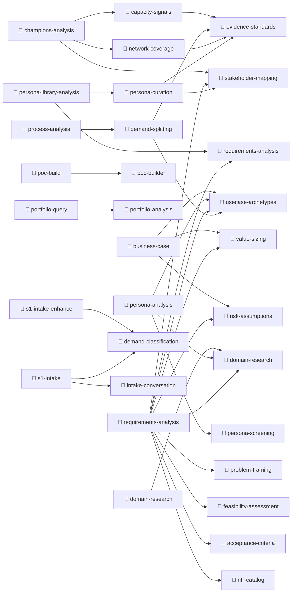

<!-- GENERATED by scripts/gen-docs.mjs — do not edit by hand. Run `node scripts/gen-docs.mjs`. -->

# Governance graph

**44 playbooks · 20 skills · 6 contracts.**

A playbook composes skills, and a skill may compose skills of its own — resolved
transitively by `lib/agent/compose.ts`, which reports anything missing and terminates
on a cycle. This is what lets the platform grow by adding a file and naming it.

## Playbooks that compose skills

## Playbooks with no skills

Single-purpose prompts — the fourteen ported section coaches, the four advisory passes,
and the agent framings. They are guidance in themselves and compose nothing.

`process-advisory-challenge` · `process-advisory-clusters` · `process-advisory-improvements` · `process-advisory-target-tech` · `process-agent-advisory` · `process-agent-analysis-user` · `process-agent-digest-shape` · `process-agent-digest` · `process-agent-dimension-tail-export` · `process-agent-dimension-tail` · `process-agent-dimension` · `process-agent-section-tail-export` · `process-agent-section-tail` · `process-agent-section` · `process-dimension-coach` · `process-section-business-case` · `process-section-cost-of-change` · `process-section-diagnosis` · `process-section-diagnostics` · `process-section-flow` · `process-section-increment` · `process-section-iteration` · `process-section-knowledge` · `process-section-kpi` · `process-section-literacy` · `process-section-mapping` · `process-section-profile` · `process-section-purpose` · `process-section-toolchain` · `process-shared-context-oesl` · `process-shared-data-and-absence` · `process-shared-stance` · `process-tool-playbook`

## Skills

| Skill | Composes | Purpose |
|---|---|---|
| `acceptance-criteria` | — | Write acceptance criteria that are individually checkable during a PoC or pilot — one concrete, observable Given/When/Th |
| `capacity-signals` | `evidence-standards` | Read what the portal already knows about how much each node of the network is carrying, and turn it into support decisio |
| `demand-classification` | — | Propose a lane and domain for a captured demand, deterministically, as a suggestion for triage — never an assignment. |
| `demand-splitting` | `evidence-standards`, `usecase-archetypes` | Cut a finished process diagnosis into distinct, independently shippable demands — one per intervention, smallest valuabl |
| `domain-research` | — | Apply common domain knowledge — personas, patterns, data sources, standards — to analyse and enhance a demand. |
| `evidence-standards` | — | The shared rule for what counts as a claim you may make — every statement names the record it rests on, absence is repor |
| `feasibility-assessment` | — | Judge whether a digital use case can actually work — data, technical, and operational readiness — against its archetype' |
| `intake-conversation` | — | Guide a requester through the fixed S1 intake script in their own words, capturing answers without inventing detail. |
| `network-coverage` | `evidence-standards` | Read a hub-and-spoke network for the holes that stop work — plants with nobody, cells with a carrier but no decider, and |
| `nfr-catalog` | — | Derive non-functional requirements systematically across security, privacy, reliability, performance, usability, accessi |
| `persona-curation` | `evidence-standards`, `stakeholder-mapping` | Read a persona library for the gaps that make requirements guesswork — roles cited but never described, domains with no  |
| `persona-screening` | — | Screen a requestor's demands into a service-oriented profile — role & domain focus, jobs & daily workflows, solution-arc |
| `poc-builder` | — | Build a proof of concept for a use case — repo, spec, and artifact — with a human approval checkpoint. Use when a user a |
| `portfolio-analysis` | — | Answer portfolio questions within the caller's visibility, read-only. Use for counts by stage, what is stalling, and whe |
| `problem-framing` | — | Turn a raw, solution-shaped demand into a crisp, testable problem statement — the job to be done, the observable symptom |
| `requirements-analysis` | — | Derive standardized requirements — epics, user stories with acceptance criteria, NFRs — from a captured demand, grounded |
| `risk-assumptions` | — | Build the risk, assumption, open-question, and out-of-scope register for a digital use case — seeded by the archetype's  |
| `stakeholder-mapping` | — | Identify the personas, the accountable owner, and who must adopt a digital use case for it to deliver value — feeding us |
| `usecase-archetypes` | — | Classify a digital use case by its SOLUTION SHAPE (analytics, prediction, computer vision, GenAI/RAG, automation, optimi |
| `value-sizing` | — | Size the impact of a digital use case honestly — a defensible value hypothesis built from the baseline, the mechanism of |

## Contracts

`analyst` · `business-case` · `champions` · `intake` · `persona` · `requirements`
