<!-- GENERATED by scripts/gen-docs.mjs — do not edit by hand. Run `node scripts/gen-docs.mjs`. -->

# Pages and the endpoints they call

**37 pages.** Each row lists the `/api` paths referenced by the page and the client
components beside it. A page with no calls renders from a server component and reads its
data directly through `lib/` — which is the portal's default, not an omission.

```mermaid
graph LR
  _admin_categories(["/admin/categories"])
  _admin_categories --> _api_categories["/api/categories"]
  _analysis(["/analysis"])
  _assistant(["/assistant"])
  _assistant --> _api_agent["/api/agent"]
  _board(["/board"])
  _build(["/build"])
  _build --> _api_poc["/api/poc"]
  _catalog__type___name_(["/catalog/[type]/[name]"])
  _catalog__type___name_ --> _api_registry["/api/registry"]
  _catalog__type___name_ --> _api_registry_item["/api/registry/item"]
  _catalog__type___name_ --> _api_registry_save["/api/registry/save"]
  _catalog_new(["/catalog/new"])
  _catalog(["/catalog"])
  _champions(["/champions"])
  _champions --> _api_champions["/api/champions"]
  _champions --> _api_champions_analyse["/api/champions/analyse"]
  _demands(["/demands"])
  _digest(["/digest"])
  _funnel(["/funnel"])
  _handovers(["/handovers"])
  _intake_chat(["/intake/chat"])
  _intake_chat --> _api_intake_turn["/api/intake/turn"]
  _intake_form(["/intake/form"])
  _intake_form --> _api_categories["/api/categories"]
  _intake_md(["/intake/md"])
  _intake(["/intake"])
  _intake --> _api_intake["/api/intake"]
  _intake --> _api_intake_enhance["/api/intake/enhance"]
  _intake --> _api_intake_similar["/api/intake/similar"]
  _login(["/login"])
  _login --> _api_auth_login["/api/auth/login"]
  _(["/"])
  _personas__requestor_(["/personas/[requestor]"])
  _personas_library(["/personas/library"])
  _personas_library --> _api_personas_library["/api/personas/library"]
  _personas(["/personas"])
  _process__slug__assess__dim_(["/process/[slug]/assess/[dim]"])
  _process__slug_(["/process/[slug]"])
  _process__slug_ --> _api_process_engagements__param_report["/api/process/engagements/:param/report"]
  _process(["/process"])
  _requirements__id_(["/requirements/[id]"])
  _requirements__id_ --> _api_demands___encodeURIComponent["/api/demands/${encodeURIComponent"]
  _requirements__id_ --> _api_demands__id__verification["/api/demands/[id]/verification"]
  _requirements(["/requirements"])
  _requirements --> _api_requirements["/api/requirements"]
  _settings(["/settings"])
  _settings --> _api_status["/api/status"]
  _simulate(["/simulate"])
  _skill_library(["/skill-library"])
  _skill_library --> _api_registry_import["/api/registry/import"]
  _skill_library --> _api_registry_search["/api/registry/search"]
  _triage(["/triage"])
  _triage --> _api_demands___encodeURIComponent["/api/demands/${encodeURIComponent"]
  _triage --> _api_demands__id__advance["/api/demands/[id]/advance"]
  _triage --> _api_demands__id__triage["/api/demands/[id]/triage"]
  _uc__id__business_case(["/uc/[id]/business-case"])
  _uc__id__business_case --> _api_business_case["/api/business-case"]
  _uc__id__edit(["/uc/[id]/edit"])
  _uc__id__edit --> _api_demands___encodeURIComponent["/api/demands/${encodeURIComponent"]
  _uc__id__edit --> _api_demands__id__edit["/api/demands/[id]/edit"]
  _uc__id_(["/uc/[id]"])
  _uc__id__poc(["/uc/[id]/poc"])
  _uc__id__poc --> _api_poc["/api/poc"]
  _uc__id__simulate(["/uc/[id]/simulate"])
  _value(["/value"])
```

| Page | Calls |
|---|---|
| `/admin/categories` | `/api/categories` |
| `/analysis` | _server-rendered_ |
| `/assistant` | `/api/agent` |
| `/board` | _server-rendered_ |
| `/build` | `/api/poc` |
| `/catalog/[type]/[name]` | `/api/registry` `/api/registry/item` `/api/registry/save` |
| `/catalog/new` | _server-rendered_ |
| `/catalog` | _server-rendered_ |
| `/champions` | `/api/champions` `/api/champions/analyse` |
| `/demands` | _server-rendered_ |
| `/digest` | _server-rendered_ |
| `/funnel` | _server-rendered_ |
| `/handovers` | _server-rendered_ |
| `/intake/chat` | `/api/intake/turn` |
| `/intake/form` | `/api/categories` |
| `/intake/md` | _server-rendered_ |
| `/intake` | `/api/intake` `/api/intake/enhance` `/api/intake/similar` |
| `/login` | `/api/auth/login` |
| `/` | _server-rendered_ |
| `/personas/[requestor]` | _server-rendered_ |
| `/personas/library` | `/api/personas/library` |
| `/personas` | _server-rendered_ |
| `/process/[slug]/assess/[dim]` | _server-rendered_ |
| `/process/[slug]` | `/api/process/engagements/:param/report` |
| `/process` | _server-rendered_ |
| `/requirements/[id]` | `/api/demands/${encodeURIComponent` `/api/demands/[id]/verification` |
| `/requirements` | `/api/requirements` |
| `/settings` | `/api/status` |
| `/simulate` | _server-rendered_ |
| `/skill-library` | `/api/registry/import` `/api/registry/search` |
| `/triage` | `/api/demands/${encodeURIComponent` `/api/demands/[id]/advance` `/api/demands/[id]/triage` |
| `/uc/[id]/business-case` | `/api/business-case` |
| `/uc/[id]/edit` | `/api/demands/${encodeURIComponent` `/api/demands/[id]/edit` |
| `/uc/[id]` | _server-rendered_ |
| `/uc/[id]/poc` | `/api/poc` |
| `/uc/[id]/simulate` | _server-rendered_ |
| `/value` | _server-rendered_ |
